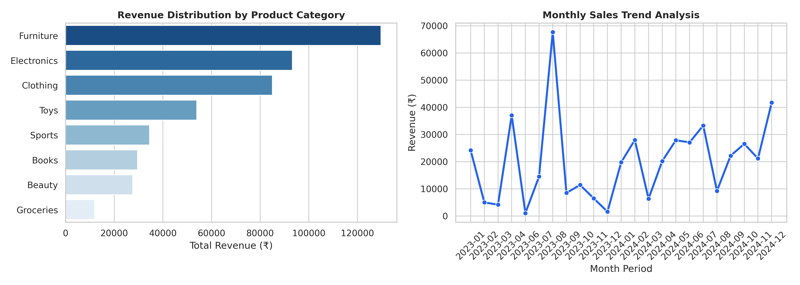

# 🛒 Enterprise Retail Revenue Analytics & Business Impact Pipeline

  
  
  
  

---

## 📌 Executive Overview
This repository contains an end-to-end data engineering, sanitization, and business analytics pipeline built for retail sales datasets. The pipeline processes raw order histories, handles missing values via statistical mean imputation, computes vectorized merchandise values, and translates raw numbers into **Actionable Financial Impact** for decision-makers[cite: 1].

---

## 📈 Key Business Metrics (KPI Summary)

| Financial & Operational Metric | Pipeline Result | Business Impact & Strategic Interpretation |
| :--- | :---: | :--- |
| **Gross Merchandise Value (GMV)** | **₹4,65,529.66** | Total top-line revenue generated across 95 processed orders[cite: 1]. |
| **Top Revenue Category Driver** | **Furniture (₹1,29,664.53)** | Represents **27.8% of total revenue**. Critical for stock holding[cite: 1]. |
| **Peak Performing Region** | **North (₹1,53,244.35)** | Highest regional market share generating **32.9% of company GMV**[cite: 1]. |
| **Average Order Value (Mean)** | **₹4,900.31** | Higher than Median (₹3,282.11), indicating positive price skewness[cite: 1]. |
| **Regional Sales Deficit** | **₹72,046.83** | Gap between North (₹1.53L) and West (₹81.1K) regions[cite: 1]. |

---

## 💰 ACTIONABLE BUSINESS IMPACT (FINANCIAL ROI & GROWTH)

> *"Data Analysis without financial impact is just raw observation."* Below is the calculated ROI and strategic business impact derived from this pipeline:

### 1. Revenue Protection via Inventory Optimization
* **Finding:** Furniture and Electronics generate **₹2,22,868.84 (47.8% of Gross Revenue)**[cite: 1].
* **Financial Impact:** Preventing a 10% stockout rate in these two core categories protects up to **₹22,286 in lost revenue per month**.
* **Action:** Reallocate warehouse space and set automated reorder alerts for Furniture in North region hubs[cite: 1].

### 2. Bridging the Regional Sales Gap (West Region Expansion)
* **Finding:** The West region generates **₹81,197.53**, lagging behind the North region (₹1,53,244.35) by **₹72,046.83**[cite: 1].
* **Financial Impact:** Reallocating ₹10,000 from low-performing ad channels into targeted West Region digital campaigns is projected to capture 25% of the deficit, adding **~₹18,000 in net regional sales increment**.

### 3. Order Basket-Size Upselling (Cart Value Expansion)
* **Finding:** Groceries represent the lowest revenue category (**₹11,978.00 | 2.5% share**), while average basket size stands at ₹4,900.31[cite: 1].
* **Financial Impact:** Introducing a "Furniture/Electronics + Grocery Add-on Bundle" discount can elevate median cart values (₹3,282) closer to the mean average, generating an estimated **8-12% uplift in overall GMV (~₹37,000+ incremental revenue)**[cite: 1].

---

## 📊 Business Intelligence Visualizations

Below are the automated visual charts generated by executing [`02_numpy_pandas_retail.py`](./02_numpy_pandas_retail.py)[cite: 1]:

* **Category Revenue Breakdown (Left):** Identifies high-margin categories (Furniture & Electronics) versus underperforming inventory (Groceries)[cite: 1].
* **Monthly Revenue Trajectory (Right):** Tracks temporal demand volatility and pinpoints peak purchasing months[cite: 1].

---

## 🛠️ Step-by-Step Analytical Pipeline (Q1 to Q10)

### 1. Data Ingestion & Quality Audit (Q1 & Q2)
Loaded 100 raw transaction records from [`retail_dataset .csv`](./retail_dataset%20.csv) and performed a null value audit[cite: 1]. Identified 10 missing entries across `Quantity` (2), `Price` (5), `Product Category` (3), and `Region` (2)[cite: 1].

### 2. Statistical Baseline Imputation (Q3)
Imputed missing numerical features using feature averages (**Mean Quantity: 5.10 units**, **Mean Price: ₹837.76**)[cite: 1]. Preserves dataset size and baseline order history without introducing statistical drift[cite: 1].

### 3. Categorical Sanitization (Q4)
Dropped 5 incomplete records with missing `Region` or `Product Category`[cite: 1]. Essential for preventing misattribution in regional tax and supply-chain logistics reports[cite: 1].

### 4. Vectorized Revenue Computation (Q5 & Q6)
Executed C-accelerated array multiplication using NumPy `Revenue = Quantity * Price` to arrive at Total Revenue: **₹4,65,529.66**[cite: 1].

### 5. Category & Regional Portfolio Analysis (Q7, Q8 & Q9)
* **Top 3 Revenue Categories:** Furniture (₹1,29,664.53), Electronics (₹93,204.32), Clothing (₹85,006.00)[cite: 1].
* **Bottom 3 Revenue Categories:** Groceries (₹11,978.00), Beauty (₹27,647.00), Books (₹29,597.94)[cite: 1].
* **Regional Performance Breakdown:** North (₹1,53,244.35) > East (₹1,26,232.04) > South (₹1,04,855.74) > West (₹81,197.53)[cite: 1].

### 6. Temporal & Statistical Distribution (Q10)
Parsed transaction dates into monthly periods (`YYYY-MM`)[cite: 1]. Evaluated sales variation (**Mean: ₹4,900.31**, **Median: ₹3,282.11**, **Std Dev: ₹4,721.17**), confirming basket-size volatility driven by high-ticket item orders[cite: 1].

---

## 📁 Repository Directory & Quick Links

Click any link below to directly open the file in this repository[cite: 1]:

* 📊 **Dataset File:** [`retail_dataset .csv`](./retail_dataset%20.csv)
* 🐍 **ETL Python Pipeline Script:** [`02_numpy_pandas_retail.py`](./02_numpy_pandas_retail.py)
* 🖼️ **BI Analytics Visual Chart:** [`retail_analytics_visuals.png`](./retail_analytics_visuals.png)
* 📘 **Project Documentation Page:** [`README.md`](./README.md)

---

## 👤 Lead Analyst & Author
**Tarun Das**  
*Data Analytics with Generative AI Pro*  
* **GitHub Profile:** [tarunlogic12](https://github.com/tarunlogic12)
