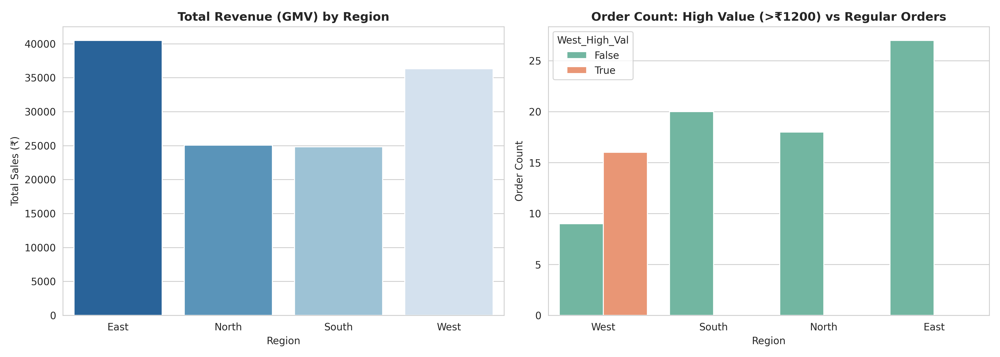

# 🐼 Enterprise Pandas DataFrame Analytics & Query Pipeline

  
  
  

---

## 📌 Executive Overview
This repository contains an end-to-end data manipulation, inspection, query indexing, and aggregation analysis pipeline built using **Python and Pandas**. The pipeline processes raw transactional data (`Retail_dataset.csv`), executes positional and label-based indexing (`.loc` / `.iloc`), performs multi-condition logical filtering, and evaluates summary statistics for enterprise sales decision-making.

---

## 📈 Key Business Metrics & Summary (KPI Table)

| Analytical Metric | Pipeline Result | Business Interpretation |
| :--- | :---: | :--- |
| **Total Order Revenue (GMV)** | **₹1,26,620.00** | Total sales value generated across all 90 transactional records. |
| **Average Ticket Size (Mean Sales)** | **₹1,406.89** | Average monetary value per processed order across all regions. |
| **Maximum Order Value** | **₹2,455.00** | Peak single-transaction sales value recorded in the dataset. |
| **Minimum Order Value** | **₹515.00** | Lowest single-transaction sales baseline recorded. |
| **High-Value West Sales Count** | **16 Orders** | Transactions in the West region exceeding ₹1,200 in revenue. |

---

## 💰 ACTIONABLE BUSINESS IMPACT & INSIGHTS

> *"Structured querying transforms raw transactional tables into strategic growth roadmap."*

### 1. High-Value Regional Sales Capture
* **Finding:** Identified **16 high-value orders** in the **West Region** generating sales above **₹1,200**.
* **Financial Impact:** Capturing high-ticket customers in the West region accounts for a significant portion of overall profitability.
* **Action:** Launch dedicated loyalty rewards for top-tier West region buyers to sustain high-basket values.

### 2. Basket Size & Order Valuation Baseline
* **Finding:** Order sales range from a minimum of **₹515.00** to a peak of **₹2,455.00**, with a mean order size of **₹1,406.89**.
* **Financial Impact:** Understanding ticket size distribution allows for effective bundle pricing strategies.
* **Action:** Introduce cart-upsell prompts for orders under ₹1,000 to move average order value closer to ₹1,800+.

---

## 📊 Business Intelligence Analytics Visual

---

## 🛠️ Step-by-Step Analytical Pipeline (Q1 to Q10)

### 1. DataFrame Creation from Dictionary (Q1)
Constructed a Pandas DataFrame containing sample product inventory, region, sales, and quantity attributes.

### 2. Dataset Structure & Quality Inspection (Q2)
Audited 90 transactional records from `Retail_dataset.csv`. Checked data types, null counts, memory usage via `info()`, and evaluated baseline dimensions (`90 rows, 6 columns`).

### 3. Targeted Feature Selection (Q3)
Filtered high-priority operational features (`Product`, `Region`, `Sales`) into a specialized subset for streamlined reporting.

### 4. Label & Positional Indexing (.loc & .iloc) (Q4 & Q5)
* **Label Indexing (`.loc`):** Retreived complete order history at Index `10` and isolated exact Sales revenue at Index `20` (`₹1,021.00`).
* **Positional Slicing (`.iloc`):** Extracted `6x4` feature sub-matrix and isolated 3rd row sales value (`₹1,597.00`).

### 5. Multi-Condition Logical Filtering (Q6, Q7 & Q8)
Executed boolean masking across regional segments. Filtered high-ticket transactions in the `West` region with sales exceeding `₹1,200` (16 total orders).

### 6. Descriptive & Aggregation Statistics (Q9 & Q10)
Generated full numerical distribution profile using `describe()`. Calculated dataset-wide summary metrics: **Total GMV ₹1,26,620.00**, **Average Order ₹1,406.89**, **Peak Sale ₹2,455.00**, and **Max Quantity 8 units**.

---

## 📁 Repository Directory & Clickable Quick Links

Click any link below to open the corresponding repository file directly on GitHub:

* 📊 **Raw Transactional Dataset:** [Retail_dataset.csv](https://github.com/tarunlogic12/Python-Data-Analytics-Portfolio/blob/main/03_Pandas_DataFrame_Analytics/Retail_dataset.csv)
* 🐍 **ETL & Pandas Pipeline Script:** [03_pandas_dataframe_assignment.py](https://github.com/tarunlogic12/Python-Data-Analytics-Portfolio/blob/main/03_Pandas_DataFrame_Analytics/03_pandas_dataframe_assignment.py)
* 🖼️ **Generated Visual Summary Chart:** [pandas_analytics_summary.png](https://github.com/tarunlogic12/Python-Data-Analytics-Portfolio/blob/main/03_Pandas_DataFrame_Analytics/pandas_analytics_summary.png)
* 📘 **Project Documentation Page:** [README.md](https://github.com/tarunlogic12/Python-Data-Analytics-Portfolio/blob/main/03_Pandas_DataFrame_Analytics/README.md)

---

## 👤 Lead Analyst & Author
**Tarun Das**  
*Data Analytics with Generative AI *  
* **GitHub Profile:** [tarunlogic12](https://github.com/tarunlogic12)
