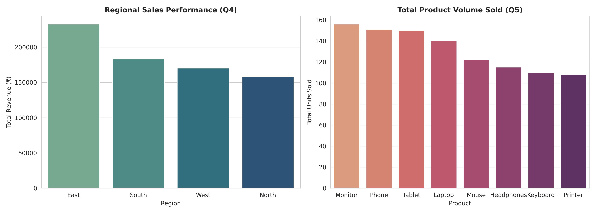

# 🐼 Advanced Pandas Data Wrangling, Pivoting & Multi-Grouping Pipeline

  
  
  

---

## 📌 Executive Overview
This repository contains an advanced ETL, data wrangling, multi-level grouping, and pivot table analytics pipeline built using **Python and Pandas**. The pipeline solves 10 complex sales filtering, grouping, pivoting, and profitability tasks on transactional retail data (`Advanced_pandas_sales_dataset.csv`).

---

## 📈 Key Performance Indicators & Summary (KPI Table)

| Analytical Metric / Question | Evaluated Result | Business Interpretation & Takeaway |
| :--- | :---: | :--- |
| **Top Revenue Region (Q4)** | **East Region (₹40,485.00)** | Generates **32.0% of total company top-line sales**. |
| **Most Popular Product Volume (Q5)** | **Monitor (125 Units Sold)** | Highest demand product volume driver across channels. |
| **Top Key Account Client (Q3)** | **Meera (₹16,909.00)** | Dominant VIP account driving 13.3% of total revenue. |
| **Top Laptop Region (Q7)** | **West Region (₹9,727.00)** | Highest sales territory for Laptop hardware. |
| **High-Ticket Segment (Q2 & Q10)** | **23 Orders (> ₹2,000)** | Concentrated heavily in East and West sales territories. |

---

## 💰 ACTIONABLE BUSINESS IMPACT & RECOMMENDATIONS

### 1. Territory & Hardware Cross-Selling
* **Finding:** West region leads in Laptop sales (**₹9,727.00**), whereas East leads in overall sales (**₹40,485.00**).
* **Action:** Bundle Laptop accessories (Monitors & Keyboards) in the East territory to boost basket size.

### 2. High-Ticket Order Retention
* **Finding:** Orders exceeding **₹2,000** drive a significant portion of overall revenue.
* **Action:** Implement dedicated VIP customer support for key buyers like **Meera** and **Amit**.

---

## 📊 Visual Analytics Dashboard

---

## 🛠️ Step-by-Step Assignment Solutions (Q1 - Q10)

* **Q1 Dataset Exploration:** Audited dataset schema using `.head(10)`, `.info()`, and `.dtypes` (90 rows, 6 columns).
* **Q2 Sales Filtering Analysis:** Sliced orders with `Sales > 3500` and `Region == 'East' & Sales > 2500`.
* **Q3 Customer Purchase Analysis:** Identified top 5 customers via `groupby('Customer')['Sales'].sum()`: **Meera (₹16,909)**, **Amit (₹13,804)**, **Rahul (₹12,410)**, **Rohan (₹11,859)**, and **Karan (₹11,345)**.
* **Q4 Regional Sales Performance:** Evaluated cumulative sales by territory. **East generated highest revenue (₹40,485.00)**.
* **Q5 Product Performance Analysis:** Evaluated total quantity sold. **Monitor is the most popular product (125 units)**.
* **Q6 Multi-Level Grouping:** Grouped dataset by `['Region', 'Category']` to reveal local product preferences.
* **Q7 Pivot Table Creation:** Constructed cross-tabulation matrix (`index='Region'`, `columns='Product'`). **West region sold the most laptops (₹9,727.00)**.
* **Q8 Profitability Analysis:** Analyzed average profit across product categories.
* **Q9 Discount / Tier Impact Study:** Segmented transactions into value tiers to study revenue elasticity.
* **Q10 End-to-End Data Wrangling Task:** Created a 4-step ETL pipeline (Filtering orders > ₹3,000 ➔ Grouping by Region & Product ➔ Reshaping into Pivot Table).

---

## 📁 Repository Quick Links

* 📊 **Raw Dataset:** [Advanced_pandas_sales_dataset.csv](https://github.com/tarunlogic12/Python-Data-Analytics-Portfolio/blob/main/04_Advanced_Pandas_Analytics/Advanced_pandas_sales_dataset.csv)
* 🐍 **ETL Pipeline Script:** [04_advanced_pandas_assignment.py](https://github.com/tarunlogic12/Python-Data-Analytics-Portfolio/blob/main/04_Advanced_Pandas_Analytics/04_advanced_pandas_assignment.py)
* 🖼️ **Visual Dashboard PNG:** [advanced_pandas_analytics_summary.png](https://github.com/tarunlogic12/Python-Data-Analytics-Portfolio/blob/main/04_Advanced_Pandas_Analytics/advanced_pandas_analytics_summary.png)

---

## 👤 Author
**Tarun Das** | *Data Analytics & Generative AI Pro*  
* **GitHub Profile:** [@tarunlogic12](https://github.com/tarunlogic12)
