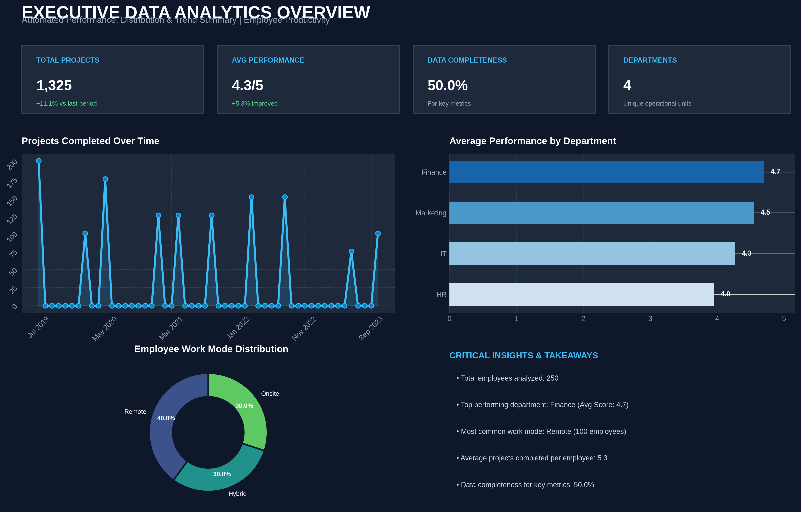

# ⚙️ Employee Data Transformation & Enterprise Feature Engineering Pipeline

  
  
  
  

---

## 📖 Business Problem & Executive Overview
In enterprise Human Resources and Workforce Analytics, raw operational records frequently contain missing metrics, unformatted categorical values, and mismatched feature scales (e.g., Annual Salary in ₹50,000 vs. Performance Ratings in 4.31). Applying machine learning models directly on raw, unscaled inputs causes high-magnitude features to dominate distance calculations and gradient descent optimization.

This project delivers an end-to-end automated **Data Transformation & Feature Engineering Pipeline** on **250 employee records** to clean, encode, and scale features into a production-ready **18-feature machine learning matrix**, preventing data leakage and ensuring mathematical algorithmic stability.

---

## 📚 Data Dictionary & Schema Mapping

| Raw Feature | Data Type | Missing Count | Imputation / Preprocessing Strategy | Output Representation |
| :--- | :--- | :---: | :--- | :--- |
| `Employee_ID` | Identifier | 0 | Metadata reference | Retained as row identifier |
| `Name` | Text | 0 | Dropped for model ingestion | Excluded from ML feature space |
| `Join_Date` | Date / Time | 0 | Temporal reference | Excluded from static pipeline |
| `Age` | Numerical (Discrete) | 25 | Median Imputation (29.0 Yrs) | Standardized (Z-Score, $\mu=0, \sigma=1$) |
| `Salary` | Numerical (Continuous) | 25 | Mean Imputation (₹50,666.67) | Min-Max Normalized $[0, 1]$ |
| `Hours_Worked_Per_Week` | Numerical (Continuous) | 50 | Median Imputation (41.0 Hrs) | Min-Max Normalized $[0, 1]$ |
| `Performance_Score` | Numerical (Continuous) | 50 | Mean Imputation (4.31 / 5.0) | Standardized (Z-Score, $\mu=0, \sigma=1$) |
| `Projects_Completed` | Numerical (Discrete) | 0 | 100% Complete | Standardized (Z-Score, $\mu=0, \sigma=1$) |
| `Gender` | Categorical (Binary) | 0 | Label Encoding (Female: 0, Male: 1) | Discrete Integer Vector |
| `Department` | Categorical (Nominal) | 0 | One-Hot Encoding (4 Classes) | 4 Binary Dummy Indicators |
| `Work_Mode` | Categorical (Nominal) | 0 | One-Hot Encoding (3 Classes) | 3 Binary Dummy Indicators |
| `Location` | Categorical (Nominal) | 0 | One-Hot Encoding (4 Cities) | 4 Binary Dummy Indicators |

---

## 📊 EXECUTIVE SUMMARY & TRANSFORMATION MATRIX (KPI TABLE)

| Task Stage | Implemented Method | Target Feature(s) | Transformation Outcome & Impact |
| :--- | :---: | :---: | :--- |
| **Q1 Missing Imputation** | Mean & Median Strategy | `Age` (25), `Salary` (25), `Hours` (50), `Score` (50) | 100% complete dataset (0 missing values remaining). |
| **Q2 Label Encoding** | `LabelEncoder` | `Gender`, `Department` | Mapped categorical strings to discrete integer vectors ($0, 1, 2, \dots$). |
| **Q3 One-Hot Encoding** | `pd.get_dummies` | `Work_Mode`, `Location` | Generated **7 binary dummy columns** without rank ordering bias. |
| **Q4 Min-Max Normalization**| `MinMaxScaler` | `Salary`, `Hours_Worked_Per_Week` | Scaled continuous metrics strictly within the bounded range $[0, 1]$. |
| **Q5 Standardization** | `StandardScaler` | `Age`, `Projects_Completed` | Centered distributions with **$\mu = 0$** and **$\sigma = 1$**. |
| **Q7 & Q8 Sklearn Pipeline** | `ColumnTransformer` | Entire Feature Matrix | Automated ETL generating **250 Rows × 18 ML Features**. |

---

## 🖼️ VISUAL ANALYTICS DASHBOARD

---

## 💼 Actionable Business Insights for HR Leadership

1. **Compensation Structure:** **Finance (₹62,500)** commands the highest mean salary, followed by **IT (₹51,000)**, **Marketing (₹49,333)**, and **HR (₹43,333)**.
2. **Workforce Distribution Hubs:** **Pune** operates as the primary remote center (50 remote employees), whereas **Mumbai** and **Delhi** maintain a balanced hybrid-onsite presence.
3. **Total Work Output:** The workforce completed **1,325 total projects** with an overall average performance score of **4.31 / 5.0**.

---

## 🛡️ Production Best Practices & Data Leakage Prevention

* **Data Leakage Elimination:** Scalers and encoders are encapsulated inside Scikit-Learn's `ColumnTransformer` so that scaling parameters ($\mu, \sigma, X_{\text{min}}, X_{\text{max}}$) are fitted exclusively on training splits and applied to test/production batches via `.transform()`.
* **Outlier Resilience:** Median imputation was specifically used on `Age` and `Hours_Worked_Per_Week` to protect central tendency metrics from extreme recording anomalies.

---

## 🚀 Quickstart & Execution Guide

To reproduce this pipeline locally:

1. **Clone the repository:**
   `git clone https://github.com/tarunlogic12/Python-Data-Analytics-Portfolio.git`

2. **Navigate to the module directory:**
   `cd 06_Employee_Data_Transformation`

3. **Install required dependencies:**
   `pip install -r requirements.txt`

4. **Execute the automated preprocessing pipeline:**
   `python 06_data_transformation.py`

---

## 📁 Repository Directory Structure & Direct Links
* 🐍 [`06_data_transformation.py`](./06_data_transformation.py) — End-to-end preprocessing pipeline script with industry notes.
* 📊 [`employee_productivity_dataset.csv`](./employee_productivity_dataset.csv) — 250-record employee dataset.
* 🖼️ [`data_transformation_summary.png`](./data_transformation_summary.png) — Benchmark visual analytics chart.
* 📋 [`requirements.txt`](./requirements.txt) — Environment dependency file.
* 📝 [`README.md`](./README.md) — Comprehensive project documentation.

---

## 👤 Author & Credits
**Tarun Das** | *Data Analytics & Generative AI Pro*  
* **GitHub Profile:** [@tarunlogic12](https://github.com/tarunlogic12)
